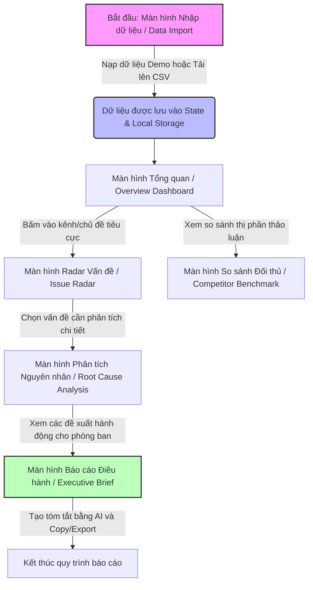

# USER JOURNEYS & SCREEN TRANSITIONS (USER_FLOW.md)
## Guardian Insight Radar - Voice of Customer MVP

Tài liệu này mô tả chi tiết luồng trải nghiệm người dùng (User Flows), cách chuyển đổi giữa các màn hình và cấu trúc bố cục giao diện của Guardian Insight Radar.

---

### 1. BẢN ĐỒ LUỒNG NGƯỜI DÙNG (USER FLOW MAP)

Giao diện ứng dụng sử dụng cấu trúc **Sidebar Navigation** cố định phía bên trái để chuyển đổi nhanh giữa các màn hình, giúp người dùng liên tục theo dõi và phân tích dữ liệu một cách liền mạch.

---

### 2. CHI TIẾT CÁC KỊCH BẢN TRẢI NGHIỆM (USER SCENARIOS)

#### Kịch bản 1: Người dùng mới bắt đầu bằng Dữ liệu giả lập (Demo Data)
1. **Bước 1**: Người dùng truy cập ứng dụng. Màn hình đầu tiên hiển thị là **Nhập dữ liệu (Data Import)**. Hệ thống hiển thị trạng thái chưa có dữ liệu phân tích.
2. **Bước 2**: Người dùng nhấn vào nút **"Nạp Dữ liệu Demo (Giả lập)"** màu cam nổi bật.
3. **Bước 3**: Ứng dụng nạp ngay hàng trăm bình luận giả lập của Guardian, Hasaki và Watsons từ file dữ liệu tích hợp sẵn.
4. **Bước 4**: Hệ thống tự động phân tích cơ bản (số lượng, thương hiệu, kênh) và chuyển hướng người dùng sang **Bảng điều khiển Tổng quan (Overview Dashboard)**.
5. **Bước 5**: Dữ liệu giờ đây đã được hiển thị sống động qua các biểu đồ Recharts.

#### Kịch bản 2: Tải lên dữ liệu thực tế bằng tệp CSV (Import CSV)
1. **Bước 1**: Từ menu bên trái, người dùng chọn **Nhập dữ liệu**.
2. **Bước 2**: Người dùng tải xuống tệp CSV mẫu để xem cấu trúc yêu cầu (gồm các cột: `brand`, `channel`, `rating`, `review_text`, `date`).
3. **Bước 3**: Người dùng kéo và thả hoặc chọn tệp CSV của mình tải lên.
4. **Bước 4**: Thư viện Papa Parse thực thi phân tích tệp ở Client, Zod kiểm tra tính hợp lệ của từng hàng dữ liệu.
5. **Bước 5**: Các hàng không hợp lệ sẽ hiển thị thông báo lỗi chi tiết để sửa đổi. Các hàng hợp lệ được đưa vào bộ nhớ ứng dụng.
6. **Bước 6**: Người dùng chuyển sang **Bảng điều khiển Tổng quan** để xem thống kê tổng hợp.

#### Kịch bản 3: Phân tích sâu nguyên nhân gốc rễ và đề xuất phòng ban
1. **Bước 1**: Người dùng truy cập **Radar Vấn đề (Issue Radar)** để xem danh sách các sự cố được AI phân loại và xếp hạng theo mức độ ưu tiên (tần suất phản hồi tiêu cực x độ nghiêm trọng).
2. **Bước 2**: Người dùng nhận thấy vấn đề *"Khách hàng phàn nàn về việc giao hàng chậm trễ của Shopee trong đợt khuyến mãi"* đang có độ ưu tiên cao nhất.
3. **Bước 3**: Người dùng bấm chọn vấn đề này. Hệ thống tự động dẫn sang màn hình **Phân tích Nguyên nhân (Root Cause Analysis)**.
4. **Bước 4**: Tại đây, người dùng nhấn nút **"Yêu cầu AI Phân tích Sâu"** (hoặc xem kết quả đã được phân tích sẵn nếu nạp demo). Gemini API sẽ trả về cấu trúc nguyên nhân gốc rễ (ví dụ: do quá tải đơn vị vận chuyển bên thứ 3) cùng với các trích dẫn đánh giá thực tế của khách hàng (Evidence) làm minh chứng.
5. **Bước 5**: Đề xuất hành động hiện ra: *"Thương lượng lại SLA với đơn vị vận chuyển Shopee Express hoặc bổ sung đơn vị SPX"* giao cho bộ phận **E-commerce Team**.

#### Kịch bản 4: Trình báo cáo cấp cao cho Ban Giám Đốc
1. **Bước 1**: Business Leader truy cập màn hình **Báo cáo Điều hành (Executive Brief)**.
2. **Bước 2**: Nhấn nút **"Tạo Báo cáo Bằng AI"**.
3. **Bước 3**: Gemini API tổng hợp dữ liệu từ tất cả các kênh và kết quả phân tích của Guardian để tạo một văn bản tóm tắt điều hành bằng tiếng Việt có cấu trúc chặt chẽ (Tình hình chung, Các vấn đề khẩn cấp, Đề xuất hành động theo phòng ban).
4. **Bước 4**: Người dùng nhấn **"Sao chép Báo cáo"** để dán vào email gửi cho ban giám đốc, hoặc tải xuống dưới dạng tệp văn bản.

---

### 3. QUY TẮC CHUYỂN ĐỔI MÀN HÌNH (NAVIGATION & TRANSITION RULES)

*   **Thanh điều hướng bên (Sidebar Navigation)**: Luôn hiển thị trên màn hình Desktop. Mỗi mục trong menu hiển thị rõ Tên màn hình (tiếng Việt), icon trực quan và trạng thái đang chọn (Active).
*   **Trạng thái Dữ liệu trống (Empty State)**: Nếu chưa nạp dữ liệu (cả demo hoặc tải lên), các màn hình Dashboard, Issue Radar, Root Cause, Competitor, Executive Brief sẽ hiển thị một thông điệp đẹp mắt: *"Vui lòng nạp dữ liệu tại màn hình Nhập Dữ liệu để bắt đầu phân tích"*, kèm một nút tắt dẫn tới màn hình Import.
*   **Hiệu ứng tải dữ liệu (Loading States)**: Khi gọi API Gemini để phân tích nguyên nhân gốc rễ hoặc tạo báo cáo điều hành, hiển thị Skeleton loader hiện đại cùng biểu tượng xoay nhẹ nhàng để người dùng biết hệ thống đang xử lý, tránh bấm nút nhiều lần.
*   **Thông báo (Toast Notifications)**: Hiển thị thông báo nhỏ ở góc màn hình khi: nạp dữ liệu thành công, tệp CSV bị lỗi định dạng, hoặc sao chép báo cáo thành công.
